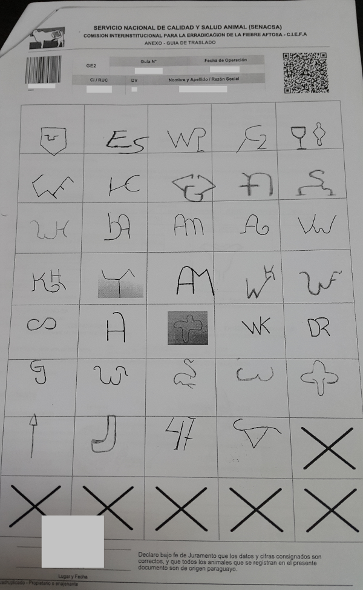

# UTILIDADES
Se prepara esta utilidad para facilitar la impresion de las imagenes de las marcas, las cuales se necesita
para completar el formulario impreso de la guia de traslado.

# INGENIERIA INVERSA
* Para poder crear las tablas de la base de datos a usar utilizo TOAD DATA MODELER por lo tanto genero el script mediante esta herramienta.
* Luego creo las tablas en una base de datos (en una instancia de SQLEXPRESS).
* Al final ejecuto el comando para realizar la ingenieria inversa.

~~~
 Scaffold-DbContext "Server=.\SQLEXPRESS;Database=GuiasBorrar;Trusted_Connection=True;" Microsoft.EntityFrameworkCore.SqlServer -OutputDir ReverseEngenieer
~~~
Esto genera las clases que representan las tablas ademas del **DbContext** dentro de la carpeta *ReverseEngenieer*

Estos pasos los consegui gracias al siguiente enlace [ASP.NET Core - Existing Database](https://docs.microsoft.com/en-us/ef/core/get-started/aspnetcore/existing-db#prerequisites)

# MIGRACION

Para usar la migracion copio todo lo generado en la carpeta **ReverseEngenieer** a la carpeta **Entities**

Despues ejecuto el comando para comenzar a usar la migracion
~~~
 add-migration "Creacion inicial" -Context "GuiaDbContext"
~~~

Al final para pasar de las clases a la base de datos por medio de la migracion ejecuto el siguiente comando
~~~
update-database -Context "GuiaDbContext"
~~~

